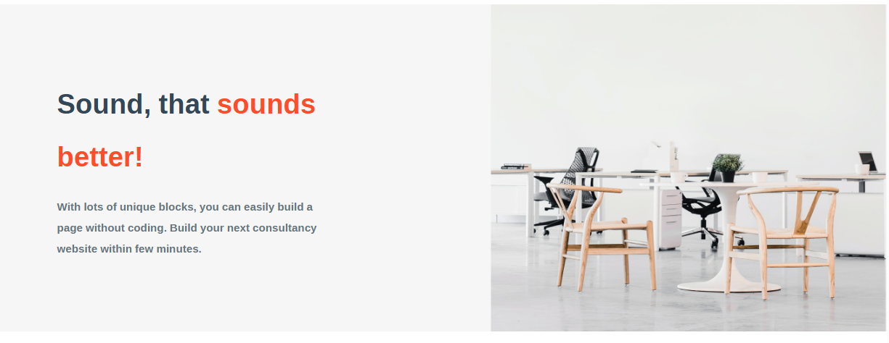
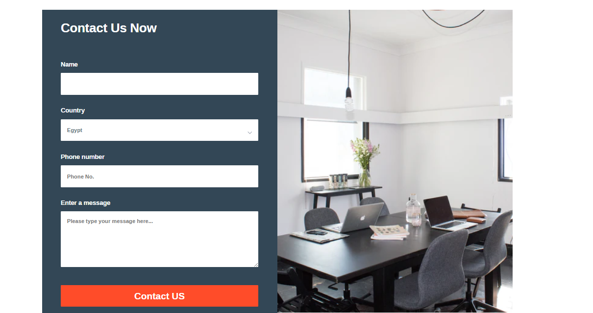
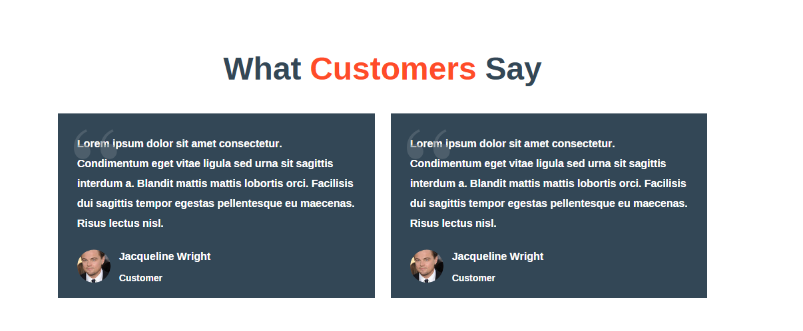
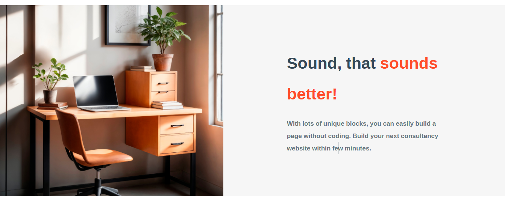

# TeradeveloperWorkSpaceTask

## 🏢 WorkSpace Page

A workspace page built using **HTML** and **CSS**, designed with **Flexbox** for layout.

## 🚀 Features

- Clean and well-structured HTML 📜
- Uses **Flexbox** for layout 🏗️
- Custom CSS styling 🎭

## 📸 Preview











## 📂 Technologies Used

- **HTML5** 🏗️
- **CSS3** 🎨 (Using **Flexbox** for layout)

## 📖 Setup Instructions

1. Clone the repository:
   ```bash
   git clone https://github.com/esraarabee1/TeradevelopersTaskWorkSpace.git
   ```
2. Navigate to the project folder:
   ```bash
   cd TeradevelopersTaskWorkSpace
   ```
3. Open `index.html` in your browser.

## 🌟 Contributing

Feel free to fork the project and submit pull requests if you want to enhance the design or add new features! 🚀
